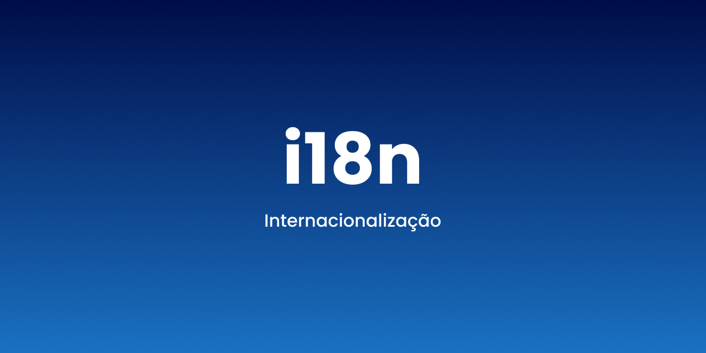

# i18n - Internacionalização de conteúdo



Projeto de testes para estudo da internacionalização de conteúdo

## Estrutura do JSON

```json
{
    // Exemplo: pt-BR
    
    // Código que representa o nome da língua de acordo com a ISO 639-2 
    "language-code": "pt",

    // Código "alpha-2" que representa o país de acordo com a ISO 3166
    "country-code": "BR",

    // Conteúdo textual e suas respectivas chaves que serão utilizadas na internacionalização do conteúdo
    "strings": {
        "heading-1": "Projeto de estudo sobre i18n",
        "heading-2": "O que é i18n?",
        "description": "i18n é o processo de design e desenvolvimento onde os produtos e/ou serviços são adaptados para idiomas e culturas locais específicas."
    }
}
```

## Referências

- [ISO 639-2 - Language Codes](https://www.loc.gov/standards/iso639-2/php/code_list.php)
- [ISO 3166 - Country Code](https://www.iso.org/iso-3166-country-codes.html)
